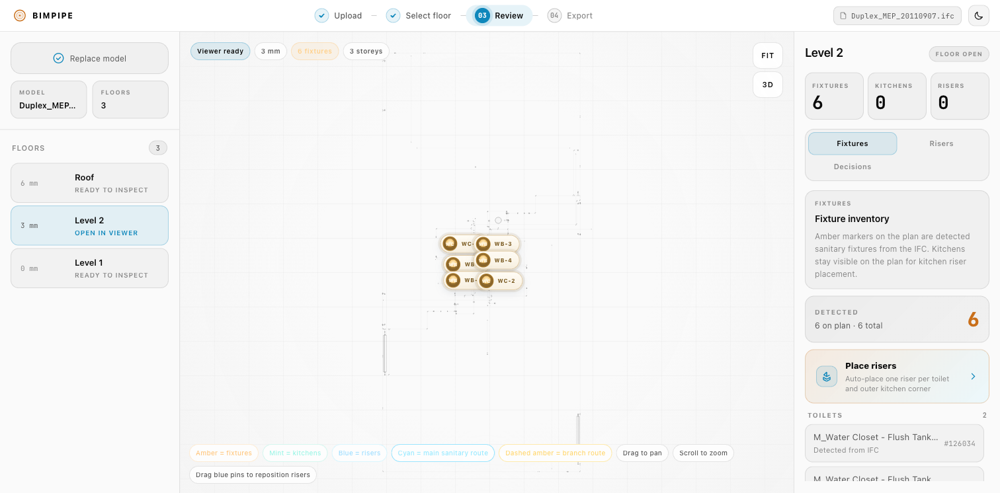
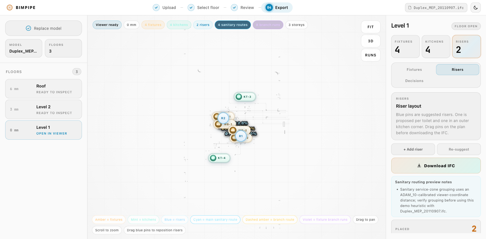
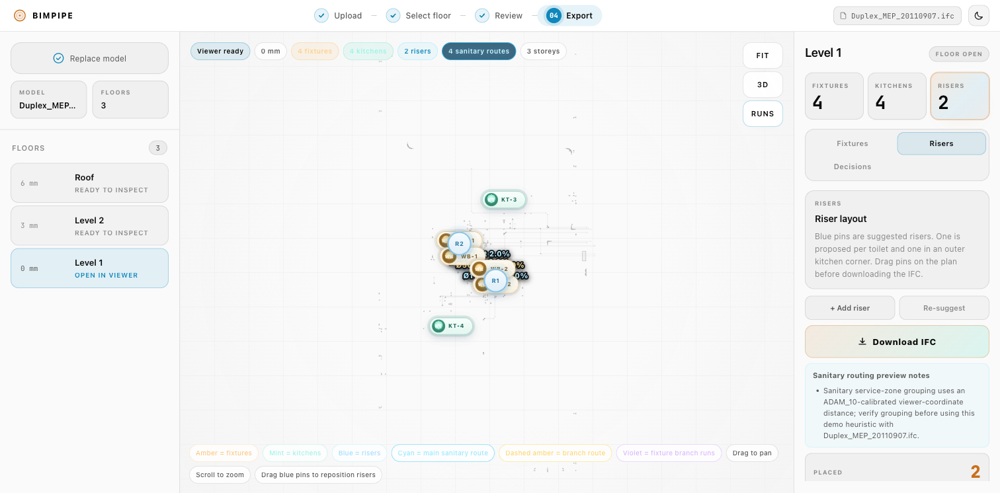
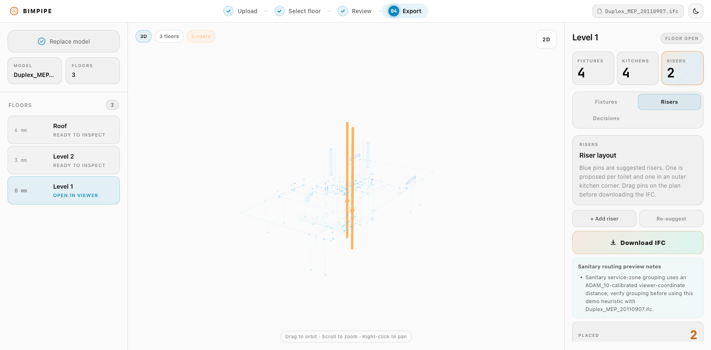
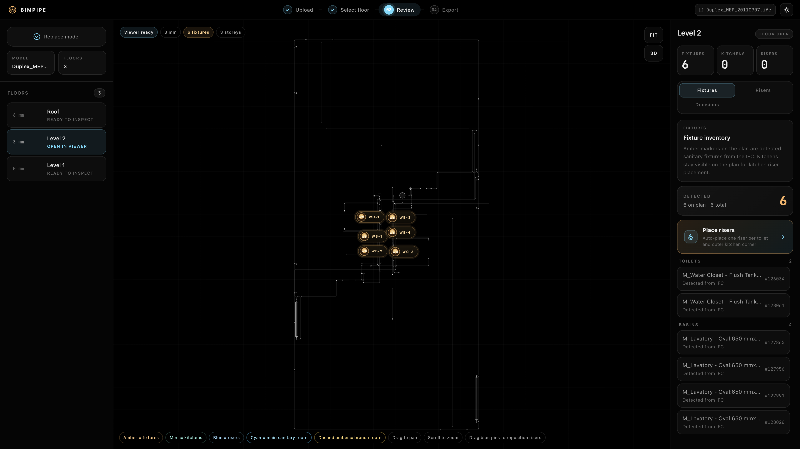

# Goal 2 — real-project 096 hardening (W0–W7)

Branch: `goal/real-project-096` · Started: 2026-09-01 · Status legend: ⏳ pending · 🔄 in progress · ✅ done · ⛔ blocked

Privacy rule for this goal: `external/` and `refs/` hold private client data and are never committed; committed content references the project only by the neutral code "096" (file codes like `096-P.ifc` are acceptable).

| Task | Status | Notes |
| --- | --- | --- |
| W0 — Hygiene (gitignore, bim11 evidence, gate) | ✅ | commit `b06e3f2` + this entry; details below |
| W0b — WorkspacePage state extraction (typed reducer) | ✅ | commits `0430fa7`, `ffe3af9` + this entry; details below |
| W1 | 🔄 | coordinate normalization in progress (parallel wave 1) |
| W2 — Units single source of truth | ✅ | commits `508e2bb`, `ccb4a61`, `9dffed2`, `7cfe9a5`; core done, 3 call sites deferred behind W1 (details below) |
| W3 | ⏳ | |
| W4 | ⏳ | |
| W5 — Vertical continuity map | ✅ core | commits `a5dddcf`, `308c880`, `1dd1786`; debug overlay wiring deferred to post-W4 (details below) |
| W6 — T4 export + adjust log | ✅ core | commits `887c3e0`, `17adbab`, `2fbcbb3`; log UI wiring deferred (details below) |
| W7 — Engineer baseline extraction + metrics | ✅ core | commits `0b0e096`, `d177c28`, `1668b7a`, `ad71263`; overlay + metrics display deferred to post-W4 (details below) |
| Push | ⏳ | |

## Goal 2 milestones

### W0 — Hygiene ✅ (2026-09-01, commit `b06e3f2` + PROGRESS commit)

- **.gitignore**: `external/` was already ignored; added `refs/` alongside it with a shared comment marking both as private client data that must never be committed (commit `b06e3f2`).
- **Nothing tracked**: `git ls-files -- refs external` outputs nothing (exit 0). `refs/096/096-floor01.pdf` remains on disk and untracked; after the ignore change, `git status` shows no `refs/`/`external/` entries at all.
- **bim11 evidence (pre-existing fix, nothing re-fixed)**: `pnpm test src/domain/decideRiserStrategyPerToiletRoom.bim11.test.ts` → 13/13 passed. The 2 historically failing assertions use exact `toBe` on the full strings (`'inherits exception coverage from primary member: …'` at test lines 244 and 312 — no `toContain`/regex loosening). Git history: the prefix was introduced deliberately by the BIM-11 commits (`589e1ba`, `179ad83`, `e395ee5`, `5463f21`); commit `d9b5f4e` ("baseline: align bim11 reason expectations with intended inherited-coverage prefix") changed exactly those 2 assertions from the bare reason strings to the full prefixed strings — a tightening to the intended values, verified via `git log -S "inherits exception coverage"` and `git show d9b5f4e`.
- **Full gate (2026-09-01 13:50)**: `pnpm lint` 0 errors, 1 known pre-existing warning (`FloorViewer.tsx` react-hooks/exhaustive-deps) · `pnpm test` **298/298** (36 files) · `pnpm build` green (`tsc -b` + vite; only the pre-existing >500 kB chunk-size warning).

### W0b — WorkspacePage state extraction ✅ (2026-09-01, commits `0430fa7`, `ffe3af9` + this entry)

Pure refactor, no behavior change intended. Parity baseline (pre-change HEAD): `a88e7f6bdacf42b4491920b2a0c0e2f75a04b73b`.

**Live demo-parity byte-diff: PASSED (2026-09-01 14:12).** Method identical to the T1 parity check: two worktrees (`a88e7f6` pre-reducer vs `f9d85e7` post-reducer), each running `DEMO_MODE=true DEMO_CONFIG=demo/adam-10/demo.config.json pnpm dev`, same input on both (bundled Duplex sample renamed to `ADAM_10.ifc` to satisfy the demo upload restriction), full observable app text captured in-browser and diffed at two checkpoints. After upload+parse: **byte-identical**. After Suggest on the Risers tab (incl. demo-scope exclusion notice, ROUTE DEMO FLOW checklist, routing intent notes): **byte-identical**. Harness torn down afterwards (worktrees removed, servers stopped, renamed stand-in deleted).

- **New `src/pages/workspacePageState.ts`**: `WorkspacePageState` interface, `initialWorkspacePageState`, lazy `createInitialWorkspacePageState()` (resolves demo runtime config once per mount, same invalid-config fallback), 27-variant discriminated-union `WorkspacePageAction`, and pure `workspacePageReducer`. No React imports. Multi-setState sequences became single actions (`upload-started`/`upload-reset`, `floor-opened`, `floor-fixtures-detected`, `risers-suggested`, …) with urgent-vs-`startTransition` dispatch split preserved exactly where the old code split setter batches across lanes.
- **`WorkspacePage.tsx`**: all 22 `useState` hooks replaced by one `useReducer`; the component now renders, derives memoized values, and dispatches. Refs kept for imperative plumbing only (`webIfcModelIdRef`, `sourceIfcBytesRef`, `nextRiserLabelRef`, `detectionDebugRef`, `risersRef`). Previously-stable setter props (`onObjectHover`, `onObjectSelect`, `onTabChange`) became `useCallback([])` dispatch wrappers so `FloorViewer` effects keyed on those identities don't re-run more than before.
- **Parity details**: the reducer shallow-compares and returns the previous state object for value-identical updates, reproducing `useState`'s bail-out (matters for hover events and the suggest flow's `demoAssetError: null` re-set); `upload-reset` clears exactly the 16 slices the old transition cleared (incl. per-storey branch-route visibility map and all risers) while preserving in-flight flags, `downloadMode`, and the demo runtime; riser `source` (`manual` vs `placed`) is never rewritten by the reducer, keeping manual-placement semantics untouched; suggest still replaces the full riser set (existing behavior, unchanged).
- **Tests**: 22 new pure reducer tests in `src/pages/workspacePageState.test.ts` (upload reset clear/preserve split, floor-open keeping risers, stack add/remove/move incl. unknown-id bail-outs, per-storey toggle defaults, download lifecycle, bail-out identity, determinism). Zero existing assertions changed.
- **Full gate (2026-09-01 14:01)**: `pnpm lint` 0 errors, 1 known pre-existing warning (`FloorViewer.tsx`) · `pnpm test` **320/320** (37 files; 298 pre-existing + 22 new) · `pnpm build` green (only the pre-existing >500 kB chunk-size warning) · `npx react-doctor@latest`: no errors in touched files (only the known pre-existing `Model3DViewer` error and pre-existing warnings).

### W2 — Units single source of truth ✅ core (2026-09-01, commits `508e2bb`, `ccb4a61`, `9dffed2`, `7cfe9a5`)

- **`src/shared/ifc/resolveModelLengthUnit.ts` (new)**: reads `IfcProject.UnitsInContext` LENGTHUNIT — SI METRE + CENTI → `cm`, MILLI → `mm`, no prefix → `m`; conversion-based units (feet), unsupported prefixes, or missing assignment return `null` (never guesses). Primary unit signal; `detectPlanUnits` stays as fallback.
- **`src/shared/lengthUnits.ts` (new)**: canonical converter/formatter — `LengthUnit = 'mm' | 'cm' | 'm'`, `toMeters`/`toMm`/`formatLengthM`/`formatLengthMm`, negative-zero normalization, no implicit defaults.
- **Sidebar wired**: `RisersPanel` (coords + demo distances through the converter, Y sign corrected to match IFC world coords as written by the exporter), `Sidebar` passes `modelLengthUnit`; `RoutesPanel`/`ValidationPanel` (currently unrendered) switched from string `unitLabel` to typed `unit`.
- **Key confirmed fact**: mesh/viewer coordinates are web-ifc-normalized meters when the model declares its unit; raw IFC attributes (storey elevations) stay in source units — the root cause of cm values labelled "mm".
- **Tests (focused)**: 19 converter + 8 unit-reader (real web-ifc engine on minimal crafted mm/cm/m/feet models) + **gated 096-P test passed live** (unit resolves to `cm`, storey 01 → "30.15 m"; skips cleanly when absent) + Sidebar 12/12. ESLint clean on touched files.
- **Deferred behind W1 (sibling owns the files this wave)**: (1) call `resolveModelLengthUnit` after `parseStoreys` in `WorkspacePage.tsx` and store in reducer state; (2) pass `modelLengthUnit` to `<Sidebar>`; (3) `StoreyList.tsx` elevation chip → `formatLengthM` (the visible "3,015 mm" → "30.15 m" fix) + its test. Coordinator wires these right after W1 lands.

### W6 — T4 export extensions + adjust log ✅ core (2026-09-01, commits `887c3e0`, `17adbab`, `2fbcbb3`)

- **Riser diameter into export**: `ExportRiser = Riser & { diameterMm?: number }`; per-stack resolution (conflicts throw, absent → `DEFAULT_RISER_DIAMETER_MM = 110`); lands in `IfcCircleProfileDef` radius, type/occurrence psets, and quantities — mm converted explicitly to source units.
- **Branch-route export**: `FloorRoutes[]` as a new trailing parameter; each `RouteSegment` becomes IfcFlowSegment (IFC2X3) / IfcPipeSegment (IFC4) in the same "BIMPipe Sanitary Stacks" IfcSystem, contained in its storey. Honest representation: straight Ø110 sweeps between sloped endpoints, no elbows/fittings (documented in code + element Description).
- **Actionable drift error**: `assertBranchRoutesConsistentWithRisers` (tolerance 1 mm) throws before writing, naming the riser, stack, both positions, and drift distance — no silent stale exports.
- **Round-trip proof**: extended tests reopen the bytes with a fresh engine — segment count = stacks + branches, branch system membership, Ø110 default + Ø160 explicit round-trip via profile radii and quantities, both drift-error paths. **Bonus real-bug fix**: IFC4 `IfcRelAssignsToGroup` without explicit `RelatedObjectsType` reopened with `RelatingGroup: null` (corrupt system membership) — fixed in the full exporter.
- **Adjust log (pure)**: `src/domain/adjustLog.ts` — discriminated-union entries `{stackId, storey, from, to, action, ts}`, immutable append, deterministic pretty-JSON serialization; 7 unit tests. Reducer/download wiring deferred to the UI-lane wave (integration points documented in the worker report).
- **Focused tests**: 39/39 across 5 export/log test files; ESLint + `tsc -b` clean on owned files.
- **Follow-up done (commit `aec607d`)**: the same `RelatedObjectsType` IFC4 bug in `exportSanitaryRouteElements.ts` fixed (explicit null instead of omitted attribute) and round-trip proven — new per-schema tests reopen the bytes and assert the sanitary-route `IfcRelAssignsToGroup` keeps a non-null `RelatingGroup` with exactly correct, disjoint membership across both systems; a negative check confirmed the IFC4 test fails without the fix. Export test suite now 34/34.

### W5 — Vertical continuity map ✅ core (2026-09-01, commits `a5dddcf`, `308c880`, `1dd1786`)

- **`src/domain/continuityMap.ts` (new, pure)**: obstruction grid (cell 250 mm / 0.25 m constant pair; row-major `Uint8Array` per storey) + shaft candidates from slab openings, shaft-named spaces (Hebrew "פיר" incl. bidi/RLM-mark handling, English "shaft"), and vertical voids aligned across ≥3 consecutive storeys (300 mm alignment tolerance). Deterministic ids/ordering; overlay-ready types (`StoreyObstructionGrid`, `ShaftCandidate` with center/bounds/polygon/storeyIds/name).
- **`src/domain/continuityFootprints.ts` (new)**: vertex→plan-bbox math with local stray world-origin vertex filtering.
- **Snapping flag**: `suggestRiserPositions` gained opt-in `continuitySnap` (+ `MAX_SNAP_MM/M` = 1500/1.5): snap to nearest free cell, prefer shaft candidates, explicit `snapMiss` reason beyond MAX_SNAP. Flag-off path is the untouched original code; a test pins `JSON.stringify` equality, and all 12 pre-existing suggest tests pass unmodified.
- **`src/shared/ifc/extractContinuityInputs.ts` (new adapter)** + gated 096-A test which ran against the real file: 13 storeys, 443 IfcSpaces, 25 shaft-named spaces found (parse ~0.6 s; full geometry tessellation deliberately excluded from the test — minutes-level — left for the coordinator's live overlay check).
- **Focused tests**: 63/63 across 4 files; ESLint + `tsc -b` clean.
- **Deferred**: 2D debug overlay + flag-on wiring in the app (post-W4 phase per coordination plan). Caller note: 096 is cm — pass explicit cell/tolerance/maxSnap overrides (or convert via the W2 unit modules); `LengthUnit` in the continuity module is mm/m only.

### W7 — Engineer baseline extraction + comparison metrics ✅ core (2026-09-01, commits `0b0e096`, `d177c28`, `1668b7a`, `ad71263`)

- **`src/shared/ifc/extractEngineerPipeNetwork.ts` (new)**: system-prefix-filtered pipe segment extraction (IfcFlowSegment/IfcPipeSegment) with storey resolution, centreline endpoints from the extrusion axis through the local-placement chain (mesh-bounds fallback filters stray world-origin vertices), IfcCircleProfileDef diameters → mm, pset `Length`/`InvertElevation` → metres null-safe, explicit unit resolution that throws instead of assuming.
- **`src/domain/engineerPipes.ts` (new, pure)**: `groupEngineerRiserStacks` — vertical segments (5° tolerance) of SW-GRV/VNT with Ø ≥ 110 mm, union-find grouped by plan midpoint within 250 mm / 0.25 m.
- **`src/domain/engineerComparisonMetrics.ts` (new, pure)**: JSON-ready comparison report — riser counts ours vs engineer, mean nearest-engineer-riser distance, branch length ratio (null-safe), fixtures assigned vs engineer-connected (honestly `null` + note: would need IfcRelConnectsPorts topology).
- **Gated 096-P test passed against the real file** (6 tests, <1 s — no mesh generation needed): storey "01" SW-GRV segments = **exactly 129**; diameters observed **{50, 63, 110} mm** (within the allowed {50, 63, 110, 160}; 160 not present on storey-01 SW-GRV); **0 null InvertElevations**; all 129 endpoints via extrusion axis; **50 engineer riser stacks, max span 3 storeys**. Synthetic real-engine tests on a programmatic cm-unit IFC2X3 model with neutral names cover slope, prefixes, psets, determinism, origin artifacts.
- **Focused tests**: 34/34 across 4 files; ESLint + tsc clean.
- **Known caveats (documented in code)**: stack storey span uses containment (096 models some risers as single full-height pipes → span understates Z-extent; Z-extent span is a natural follow-up); metrics require frame alignment between viewer plan and IFC source plan — belongs to the overlay wave.
- **Deferred**: 2D engineer-network overlay layer + metrics in Decisions/debug JSON (post-W4 phase).

---

# Goal progress — T0/T1/T2/T3-core

Branch: `goal/t0-t3-routing` · Started: 2026-08-28 · Status legend: ⏳ pending · 🔄 in progress · ✅ done · ⛔ blocked

| Task | Status | Notes |
| --- | --- | --- |
| Setup (deps, baseline lint+test) | ✅ | baseline recorded below |
| T0 — Export round-trip test | ✅ | commit `b381bd4`; ADAM_10 coverage pending asset (see Blockers) |
| T1 — Un-gate routes from demo mode | ✅ | commit `016a92d`; live `demo:adam10` parity proven (byte-identical, see below) |
| T2 — All fixture kinds + nearest-riser assignment | ✅ | commits `43e0a1e`…`b37e77c`; live ADAM_10 check pending asset |
| T3 core — Branch routing geometry (src/domain) | ✅ | commits `d9b5f4e`, `4ac9d40`, `98d287f` |
| T3 — Viewer wiring (2D/3D, per-floor toggle) | ✅ | commit `882e18e` |
| Final verification (`pnpm lint && pnpm test` full) | ✅ | lint 0 errors · 292/292 tests · build green · live dev-flow pass on Duplex MEP with screenshots |

## Baseline (clean `main`, c3e6d80, 2026-08-28 22:11)

- `pnpm install`: OK (pnpm 11.15.1, node 24.18.0)
- `pnpm lint`: 0 errors, 1 pre-existing warning (`FloorViewer.tsx` react-hooks/exhaustive-deps) — left as-is
- `pnpm test`: **2 failed** / 246 passed (31 files). Pre-existing failures in `src/domain/decideRiserStrategyPerToiletRoom.bim11.test.ts`: code prefixes inherited coverage reasons with `"inherits exception coverage from primary member: "`, tests expect the bare reason string. Reconciliation assigned to the domain worker (separate `baseline:` commit) since a green suite is required by the DoD.

## Milestones

### T0 — Export round-trip test ✅ (2026-08-28 22:17, commit `b381bd4`)

- New `src/shared/ifc/exportFullIfcWithRisers.roundtrip.test.ts` (199 lines, no production code changed): exports 2 riser stacks over 2 storeys with the real web-ifc engine, reopens the bytes with a fresh `IfcAPI`, asserts schema round-trip, segment count == stack count (`IfcFlowSegment` on IFC2X3 / `IfcPipeSegment` on IFC4), `Pset_FlowSegmentOccurrence` + `Qto_PipeSegmentBaseQuantities` linkage, `BIMPipe Sanitary Stacks` system; IFC2X3 additionally 2 `IfcPipeSegmentType` with `Pset_PipeSegmentTypeCommon`; IFC4 pins the TODO(BIM-51) gap (0 type psets) so closing it later must update the test deliberately.
- Focused runs: roundtrip 2/2 passed; all 4 export test files 25/25 passed. Coordinator re-ran roundtrip independently: 2/2 passed (822ms).
- Corruption proof: temporary `stackGroups.slice(0, 1)` mutation → both tests failed (`expected [ 96 ] to have a length of 2 but got 1`); mutation reverted (empty `git diff` on the exporter), tests green again.
- The hardcoded `#24` body-context lookup did not need replacement (fixture exercises it as-is).
- ADAM_10 clause skipped: asset not on machine (see Blockers).

### T1 — Un-gate routes from demo mode ✅ (2026-08-28 22:21, commit `016a92d`)

- Route computation runs in plain dev: new exported `buildSanitaryRoutingPlan(fixtures, risers, modelFileName)` in `buildSanitaryRoutes.ts` carries the previous planner body verbatim; `buildSanitaryRoutingDemoPlan` is now a thin demo-asserting wrapper (byte-identical demo behavior). `WorkspacePage` memo short-circuit on `!demoRuntime.enabled` removed.
- No viewer/sidebar changes needed: route lines + routes chip were already ungated; `RisersPanel` already surfaces limitations when demo is off. New component test proves dev surfacing (upload `anytower.ifc`, place risers, `routes:1`, routing preview notes visible, demo section absent).
- Tests: +4 planner tests (incl. deep-equality parity demo vs non-demo on identical inputs), +1 WorkspacePage dev-flow test. Focused runs 41/41 green; zero existing assertions changed. `pnpm build` green. Coordinator re-ran 26/26 green.
- Noted for T2/T3: suggested toilet risers coincide with toilets, so toilet routes are degenerate until risers move — pre-existing planner behavior now visible in dev; dev exports now include routes in debug JSON (intended).

### T3 core — Branch routing geometry ✅ (2026-08-28 22:24, commits `d9b5f4e` / `4ac9d40` / `98d287f`)

- Baseline reconciliation (`d9b5f4e`): the 2 pre-existing bim11 failures were stale tests — git archaeology (`f9479dd` added the tests; `e395ee5` and `5463f21` deliberately added the "inherits exception coverage from primary member:" prefix afterward) proves the prefix is intended production behavior. Test expectations updated to the exact intended strings (`toBe`, not loosened).
- `src/domain/branchRouting.ts` (types-first commit, then algorithm): pure `computeBranchRoutes(AssignedFixture[]) -> FloorRoutes[]`. X-leg-first L-shaped runs (bend at `(riser.x, fixture.z)`), riser-datum elevations at +2% × remaining run (`DEFAULT_BRANCH_SLOPE_DROP_MM = 20` per `DEFAULT_BRANCH_SLOPE_RUN_MM = 1000`), per-(storey, riser) collinear same-direction legs merged and split at junction entries so each segment carries a constant `servedFixtureExpressIds` set (trunk when >1). Units via optional `planUnits` param or local mm/m heuristic (dependency direction shared→domain respected). No obstacle avoidance — documented approximation.
- Tests: 11 new; `pnpm test src/domain` 69/69 green (worker); coordinator re-ran branchRouting + bim11: 24/24 green. `pnpm eslint src/domain` clean; `tsc --noEmit` clean.
- Follow-up candidates recorded: no snapping tolerance on collinearity; ideal-slope (not min-invert) elevations; slope constant not yet per-call parameterized.

### T2 — All fixture kinds + nearest-riser assignment ✅ (2026-08-28 22:39, commits `43e0a1e`, `2c386c0`, `1db723c`, `b37e77c`)

- `TOILETPAN` filter removed: all kinds reach state, viewer, per-kind counts in FixturesPanel, riser suggestion, and route planning. Toilets + kitchen corners are the only riser anchors; the no-toilet clustering/k-means fallback is removed (5 fallback tests intentionally replaced with non-spawning assertions).
- New pure `src/domain/assignFixturesToRisers.ts`: discriminated-union result (assigned: riser id/stack/positions/planDistance/units; unassigned: reason `no-plan-position` / `no-riser-on-storey` / `no-riser-within-branch-length`), `MAX_BRANCH_LENGTH_MM = 4000` / `_M = 4` (documented 3–5 m branch-drain rationale), same-floor only, deterministic tie-breaks. Unassigned fixtures surfaced in UI (count + badge).
- `includeShowerFloorDrains` detection flag (default off = current behavior; enabled maps shower/floor-drain incl. `מחסום רצפה` to kind `OTHER`); 3 tests prove the flip.
- Worker validation: 123 tests / 12 focused files green; eslint clean; build green; react-doctor: only pre-existing findings.
- **Coordinator integration gate after T2 (nothing in flight): `pnpm lint` 0 errors (1 pre-existing warning) · `pnpm test` 281/281 (34 files) · `pnpm build` green.** Baseline was 246 passed + 2 failed.
- Known follow-ups: planner still skips URINAL/BIDET/CISTERN/OTHER with limitation notes; viewer markers don't distinguish unassigned (T3 candidate); assignment vs planner nearest-riser can diverge in edge cases.

### T3 — Viewer wiring ✅ (2026-08-28 22:56, commit `882e18e`)

- New pure adapter `src/shared/routes/buildBranchRoutes.ts` (assigned `FixtureRiserAssignment[]` → `AssignedFixture[]` → `computeBranchRoutes`, units passed through explicitly) + `src/viewer/branchRoutePresentation.ts` (2D plan projection; 3D world segments anchored to the same storey Y anchor as riser junction spheres, so downstream ends land exactly on riser junctions and upstream ends rise at the 2% slope).
- 2D `FloorViewer`: violet polylines (trunk stroke 5 vs branch 2.6), "N branch runs" chip, legend entry, "Runs" toolbar toggle (`aria-pressed`). 3D `Model3DViewer`: two `THREE.LineSegments` groups (trunk/branch by opacity), rebuilt on prop change, disposed with scene. Per-floor visibility as `Map<StoreyId, boolean>` in `WorkspacePage` (absent = visible, reset on upload), shared by both viewers.
- Tests: +11 (4 adapter, 6 presentation, 1 component incl. toggle hide/re-show). Existing demo-path assertions unchanged (stub-only additions).
- Full gate (worker, then coordinator re-run): `pnpm lint` 0 errors (1 pre-existing warning) · `pnpm test` **292/292** · `pnpm build` green · react-doctor only pre-existing Model3DViewer finding.
- Boot smoke check clean; full live upload flow verified separately on the Duplex MEP sample (see Live verification below).

## Blockers

- `ADAM_10.ifc` is not present on this machine (`external/demo-assets/` does not exist; disk searched). Both briefs word the asset conditionally ("if accessible" / "when asset available"), so the tasks are complete without it; when the asset lands at `external/demo-assets/ADAM_10.ifc`, the optional extras are: T0 round-trip on the real asset, T2 per-kind counts on the real asset, and a full-depth `demo:adam10` route comparison (the executable demo surface is already proven byte-identical pre/post T1, see the parity section).

## Sample assets (local-only, gitignored under `external/`)

Downloaded 2026-08-28 from buildingSMART Community-Sample-Test-Files (Duplex Apartment, IFC2X3, Revit exports) for live verification:

- `external/samples/Duplex_A_20110907.ifc` (2.3 MB, architecture; 4 storeys, 21 spaces, keyword-detectable fixtures)
- `external/samples/Duplex_MEP_20110907.ifc` (17 MB, MEP; **105 `IfcFlowTerminal` entities** — best for detection/routing verification)
- `external/samples/Duplex_Plumbing_20121113.ifc` (30 MB, plumbing distribution; no terminals)

## Live verification (dev flow on Duplex MEP sample)

Dev server `pnpm dev` on `http://localhost:5174`; model `external/samples/Duplex_MEP_20110907.ifc` (17 MB, IFC2X3, 105 IfcFlowTerminal).

**Pass 2 (2026-08-28 23:14, complete — via Playwright after the IDE-browser tooling disconnected twice in pass 1):**

- Upload + parse: OK. Storeys: Roof (6 mm), Level 2 (3 mm, auto-opened), Level 1 (0 mm). Zero console errors for the entire session (info-level only).
- **T2 per-kind counts (live)**: Level 2 fixtures panel renders "Toilets 2" (M_Water Closet…) and "Basins 4" (M_Lavatory…), "6 on plan · 6 total" — multi-kind detection working (basins were invisible before T2).
- **Riser suggestion**: "Suggest" on Level 2 placed 2 stacks. Level 2 itself shows 0 risers — correct by design: with floors [Level 1, Level 2], Level 2 is classified `penthouse` and the default profile has `penthouseRule: 'exclude_new_risers'`, so the stacks span Level 1 only.
- **T1 routes (live, non-demo)**: Level 1 shows chips "4 fixtures · 4 kitchens · 2 risers · **4 sanitary routes** · **8 branch runs**"; route labels "Ø110 toilet 2.0%", "Ø63 main 2.0%", "Ø50 branch 2.0%"; honest calibration limitation note shown for the non-ADAM model; workflow reached step 04 Export with "Download IFC" enabled.
- **T3 toggle (live)**: "Runs" button `aria-pressed` true→false→true; "8 branch runs" chip disappears/reappears; SVG line count 21→13→21 (exactly −/+8 branch polylines).
- **T3 3D (live)**: 3D canvas renders (2 riser pipes visible through the model, chips "3 floors · 2 risers"). Branch-run lines in 3D are wired and unit-tested; at the default camera zoom they are not visually distinguishable in the screenshot — noted honestly.

## T1 acceptance — `pnpm demo:adam10` output unchanged (live, 2026-08-28 23:22)

Literal check of the demo parity clause, comparing the tree immediately before T1 (`4ac9d40` = `016a92d^`) against T1 itself (`016a92d`) — comparing against final HEAD would conflate T2's intentional rendering changes, which land after this acceptance gate.

- Method: two git worktrees, each running `DEMO_MODE=true DEMO_CONFIG=demo/adam-10/demo.config.json pnpm dev` (ports 5180/5181). Same input on both: the Duplex MEP sample renamed to `ADAM_10.ifc` to satisfy the demo upload restriction (the genuine asset is absent). Full observable app text captured via browser at two checkpoints and diffed.
- Checkpoint 1 — after upload + parse: **byte-identical** (3 storeys, Level 2 auto-open, 2 toilets detected, identical chips/labels).
- Checkpoint 2 — after Suggest on the Risers tab: **byte-identical**, including the demo-scope notice ("Demo scope excluded 2 fixture(s)… outside included floors"), the ROUTE DEMO FLOW checklist ("Action needed", "Use an included demo floor before routing."), and all routing intent notes (Ø110/Ø63/Ø50, 2.0% slope, 45° joins).
- The demo scope correctly rejects non-ADAM floors, so the deeper route-generation path is not reachable with a stand-in model; that path is locked by the unchanged 18 demo-planner tests plus the new deep-equality parity test (demo wrapper vs `buildSanitaryRoutingPlan` on identical inputs). Combined: the demo surface is proven unchanged live, the planner core is proven unchanged by tests.
- Harness cleaned up afterwards (worktrees removed, servers stopped, renamed stand-in deleted to avoid confusion with the real asset).

**Pass 1 (2026-08-28 23:03, partial — browser session disconnected mid-run; resumed in pass 2):**

- Upload + parse: OK (~15 s). Storeys parsed: Roof, Level 2 (auto-opened), Level 1.
- Detection on Level 2: 6 fixtures — water closets ("M_Water Closet - Flush Tank…") and lavatories ("M_Lavatory - Oval-650 mm…"); viewer chips "2 rm · 6 fixtures · 3 storeys"; WC markers rendered in two clusters; "Place risers" available.
- Runtime note: browser automation session disconnected after screenshot #1 (tooling disconnect, not an app error — no app console errors observed up to that point).

## Screenshots

_(added per milestone under `docs/progress/`)_
